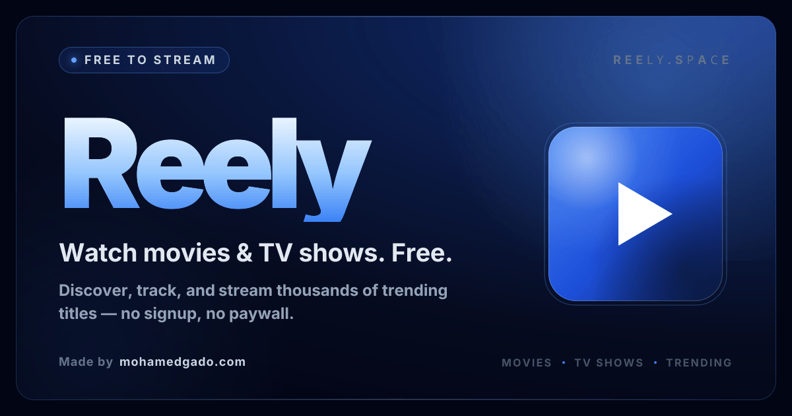

<a href="https://www.reely.space">
  
</a>

# 🎬 Reely

> Discover, track, and stream movies and TV shows — a fast, modern, TMDB-powered viewing experience.

[](https://github.com/Vette1123/movies-streaming-platform/actions/workflows/deploy.yml)


### 🚀 [Watch on Reely Space →](https://www.reely.space)

Browse trending titles, dive into rich detail pages, and pick up exactly where you left off — all from a single keyboard-friendly UI.

Reely is a production-grade movie and TV show tracker built on the TMDB API. It is designed to feel native: server-rendered for speed, animated for delight, and instrumented for serious frontend craftsmanship.

⭐ If Reely is useful to you, please star the repo.

## ✨ Features

- **TMDB-powered catalog** — trending, popular, top-rated, now-playing, and on-the-air movies and TV shows, pulled live from the TMDB API.
- **Animated hero slider** — auto-rotating showcase of trending media on the landing page, with an inline trailer preview.
- **Browse movies & TV** — dedicated listing pages with genre / year / rating filters and infinite scroll (TanStack `useInfiniteQuery` + intersection observer).
- **Rich detail pages** — synopsis, cast, similar titles, recommendations, trailer, and both IMDb and TMDB ratings — fetched in a single TMDB `append_to_response` call.
- **In-page streaming player** — watch movies and individual TV episodes via a configurable external source (see the in-app disclaimer).
- **Season & episode navigator** — drill into any TV show by season and episode with a dedicated selector.
- **Trailers** — YouTube trailer dialog plus a hero trailer preview.
- **Collections** — franchise / collection pages that group a series of films.
- **Command-palette search (⌘K)** — instant, debounced search across movies and TV via a `cmdk` dialog, with All / Movies / TV chips, inline IMDb ratings, and remembered recent searches. No page reload.
- **Genre pages & chips** — jump straight into any genre for movies or TV.
- **Real IMDb ratings** — genuine IMDb scores layered over TMDB (prebuilt dataset via the `imdb:ratings` script), with a TMDB fallback.
- **Watchlist** — save titles you want to watch, kept on your device (no account required).
- **Watch history** — track watched movies and episodes, remove single items, or clear everything, on a dedicated page.
- **URL-synced filters** — genre / year / rating state lives in the URL via `nuqs`, so filtered views are shareable and back-button friendly.
- **Web Share** — share any title through the native share sheet.
- **Privacy-first** — watchlist, history, and recent searches live entirely in your browser; there's no login and nothing is stored on a server.
- **SEO & structured data** — full JSON-LD (Website, Organization, CollectionPage, Breadcrumb), Open Graph, Twitter Cards, dynamic OG image generation, sitemap, and robots.
- **Accessible & responsive** — skip-to-content, aria roles, a dedicated mobile nav, and a dark aurora UI that scales cleanly to phones.
- **Optimized imagery** — ImageKit CDN with an automatic `wsrv.nl` → TMDB origin fallback chain.
- **Installable PWA** — see the [Progressive Web App](#-progressive-web-app) section below.
- **Analytics built in** — PostHog product analytics, on both client and server.
- **Deployed on the edge** — ships to Cloudflare Workers via OpenNext, with custom edge-cache headers, a TMDB fetch governor tuned for Workers limits, and a Cloudflare WAF setup script.

## 📲 Progressive Web App

Reely is a fully installable PWA — not just a manifest, but a working offline-resilient app shell.

- **Installable** — "Add to Home Screen" on Android/Chromium (native `beforeinstallprompt` nudge) and iOS (Share → Add to Home Screen hint). Runs standalone, portrait, with a black theme.
- **App shortcuts** — long-press the icon for **Browse Movies** and **Browse TV Shows** jump links.
- **Offline-resilient** — a hand-written service worker (`public/sw.js`, no `next-pwa`/serwist/Workbox) with a per-request caching strategy:
  - immutable `/_next/static/*` assets → **cache-first**
  - page navigations → **network-first**, falling back to the last cached page, then a custom `/offline.html`
  - icons, manifest, and images → **stale-while-revalidate**
  - never cached: the streaming player, `/api/*`, RSC payloads, and any cross-origin request
- **Native touches** — maskable icons (192 / 512), Apple touch icon, theme colors, `browserconfig.xml` / mstile, and a Safari pinned-tab icon.

> Streamed video is live third-party content and is intentionally never cached for offline playback.

## 🛠️ Tech Stack

| Layer | Technology |
| --- | --- |
| Framework | Next.js 16 (App Router, Turbopack, RSC + Server Actions) + React 19 |
| Language | TypeScript 6 |
| Styling | Tailwind CSS 4 + `tailwindcss-animate` + `@tailwindcss/typography` |
| UI | shadcn/ui + Radix UI, `lucide-react` icons, Framer Motion, `sonner` toasts |
| Data fetching | TanStack Query 5 + React Server Components |
| URL state | `nuqs` |
| Search | `cmdk` command palette + `use-debounce` |
| Infinite scroll | `react-intersection-observer` |
| PWA | Web App Manifest + hand-written service worker (no `next-pwa`/serwist) |
| Data source | [TMDB API](https://www.themoviedb.org/documentation/api) + IMDb ratings + ImageKit imagery |
| Streaming | External, configurable video source |
| Analytics | PostHog (client + server) |
| Deployment | Cloudflare Workers via [OpenNext](https://opennext.js.org/cloudflare) |
| Tooling | ESLint, Prettier, Husky, Commitlint, Renovate |

## 📖 Getting Started

### Prerequisites

- Node.js 20+
- pnpm 10+
- A free [TMDB API key](https://www.themoviedb.org/settings/api)

### Install & run

```bash
pnpm install
pnpm dev
```

Open [http://localhost:3000](http://localhost:3000).

### Build for production

```bash
pnpm build
pnpm start
```

### Deploy to Cloudflare Workers

```bash
pnpm preview   # build + preview the worker locally
pnpm deploy    # deploy via wrangler
```

### Environment variables

Copy `.env.sample` to `.env.local` and fill in the values you need. Only TMDB-related variables are required to run the app locally; the rest enable optional integrations.

| Variable | Description |
| --- | --- |
| `TMDB_API_KEY` | TMDB v3 API key (required) |
| `TMDB_HEADER_KEY` | TMDB v4 bearer token used in request headers (required) |
| `NEXT_PUBLIC_TMDB_BASEURL` | TMDB API base URL (e.g. `https://api.themoviedb.org/3`) |
| `NEXT_PUBLIC_BASE_URL` | Public base URL of your deployment |
| `NEXT_PUBLIC_STREAMING_MOVIES_API_URL` | Streaming source base URL used by the player |
| `NEXT_PUBLIC_SEARCH_ACTOR_GOOGLE` | Google search URL template for actor lookups |
| `NEXT_PUBLIC_IMAGE_CACHE_HOST_URL` | Optional image cache/CDN host |
| `NEXT_PUBLIC_POSTHOG_KEY` / `NEXT_PUBLIC_POSTHOG_HOST` | PostHog project credentials (optional) |
| `CLOUDFLARE_API_TOKEN` | Required only for `pnpm deploy` to Cloudflare Workers |

## 🙌 Credits

Built by [Mohamed Gado](https://www.mohamedgado.com/). Data and imagery courtesy of [TMDB](https://www.themoviedb.org/) — Reely is not endorsed or certified by TMDB.

[](https://buymeacoffee.com/vetteotp)
